### 1. 启动仪器。
   - 将仪器右后开关波动至"-"位置。
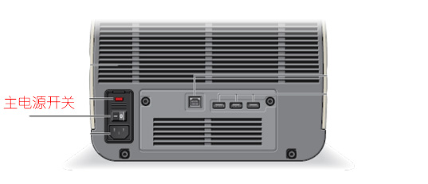
   - 按下右前触动开关，指示灯有蓝色变为白色表示仪器启动。
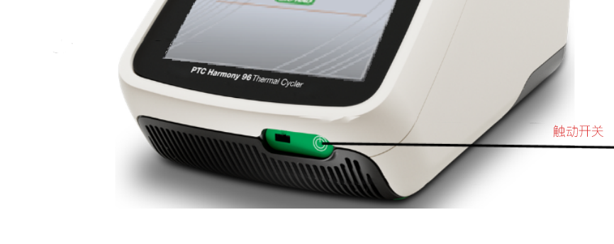
### 2. 启动完成进入待机状态。
   - 允许用户登录和创建新用户。

   - 登录已有用户。点击屏幕上已有"user name"
  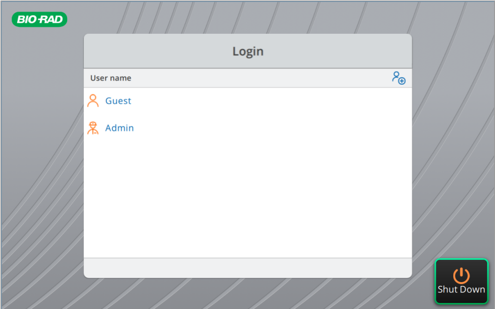
### 3. 程序设置和仪器操作界面。
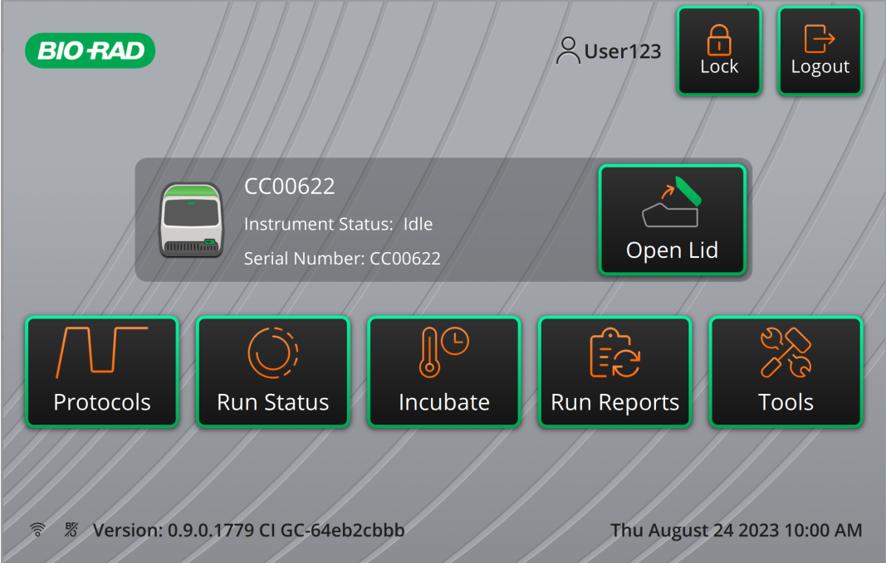
   - 可操作界面"open lid or close lid"

   - 创建程序。
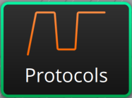
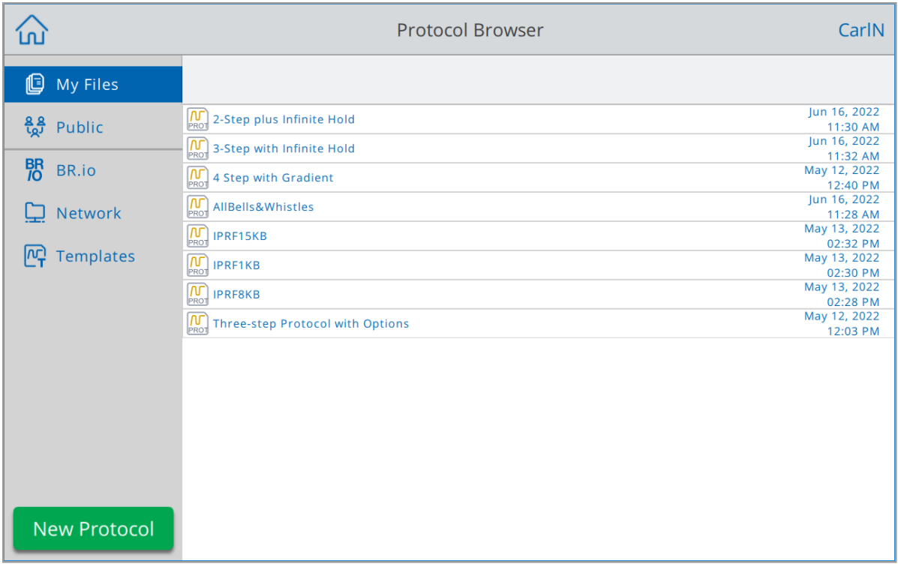
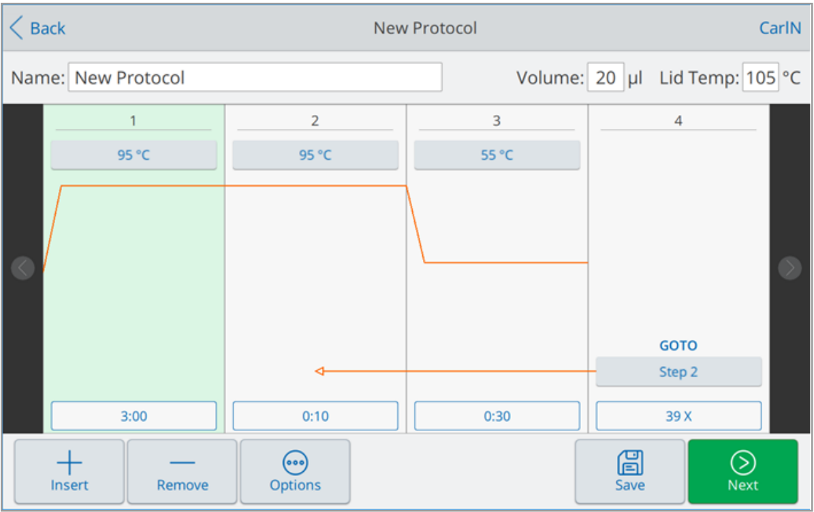
   - 设定一个温度和运行时间。

   - 设置循环数（循环数=goto+1）

   - 设置梯度功能
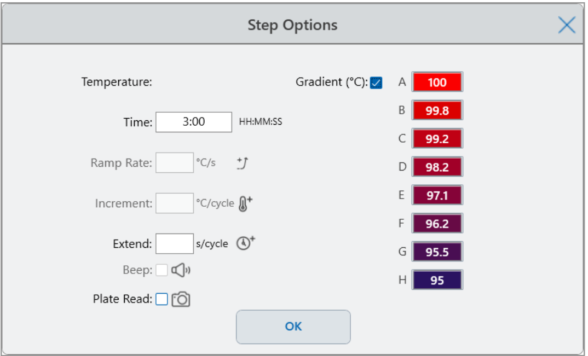
   - 存储程序
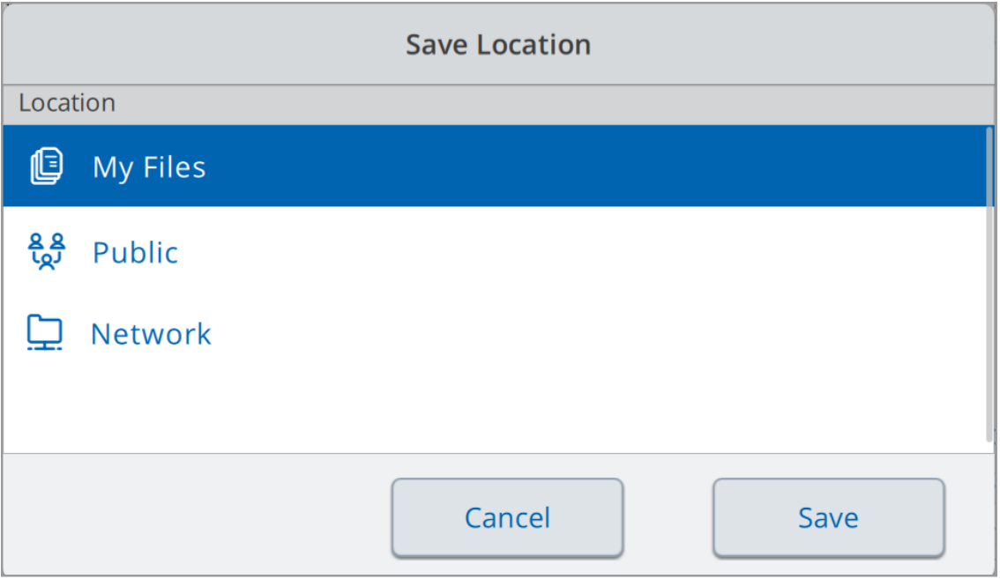
   - 运行程序。注意关注实际的样品体积和热盖温度（通常为105℃）
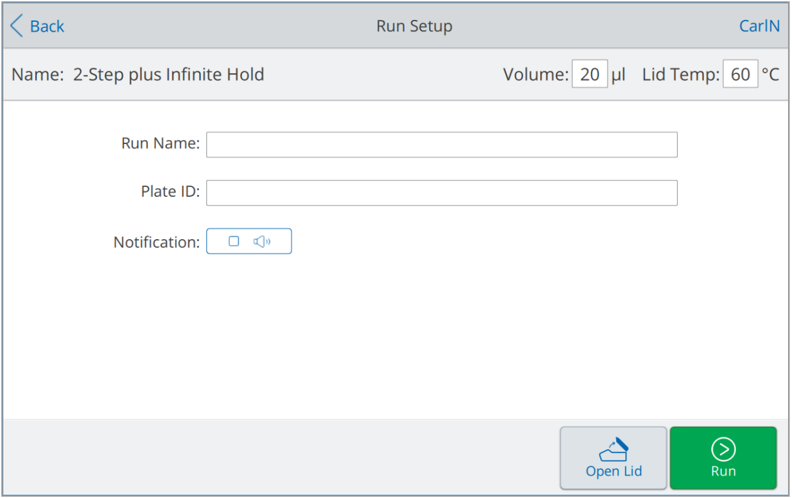
   - 结束程序。"stop run"
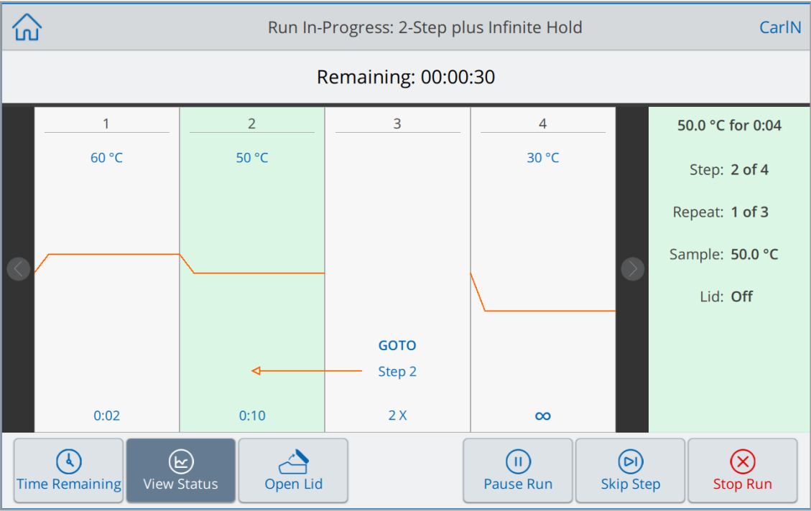
### 4.关机
   - 通过 返回主界面。
   - 通过退出当前用户。
   - 通过仪器会自动启动关机程序。
### 5.热盖支撑
   - 首推使用原装支架进行热盖支撑。
   - 在没有原装支架的情况下使用相同耗材进行支撑的方式如下。
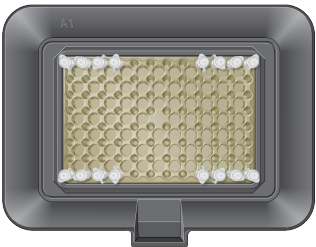 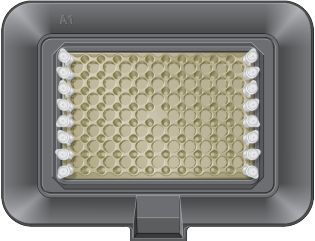 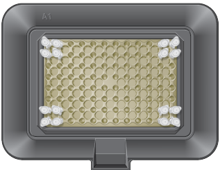 